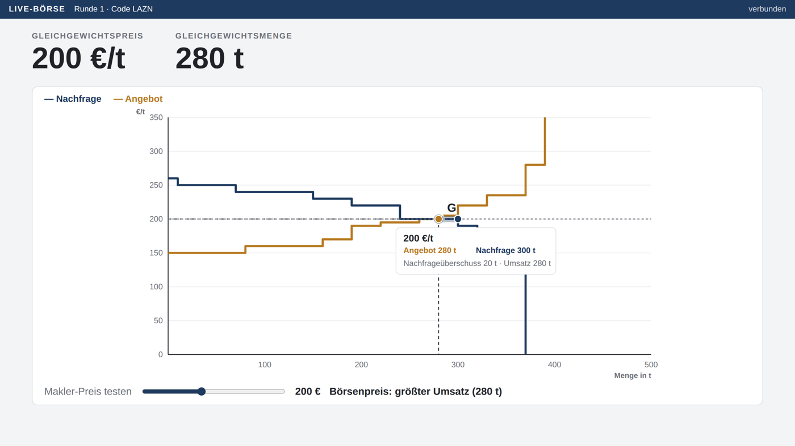
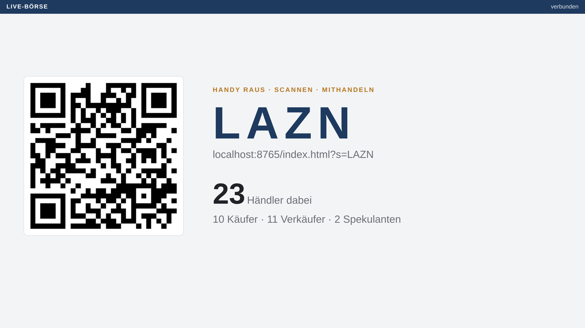
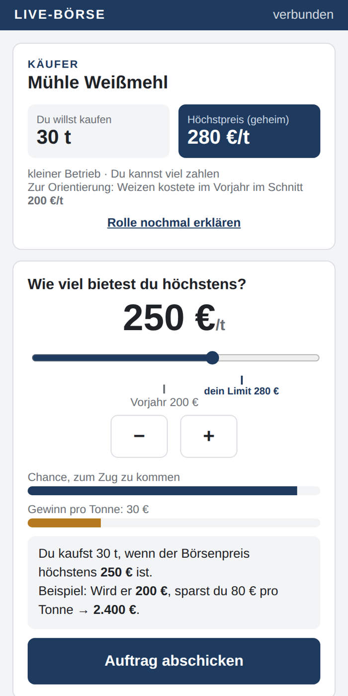

# Live-Börse – Preisbildung im Klassenzimmer

Eine Web-App, mit der eine Schulklasse eine **Getreidebörse** nachspielt: Alle handeln per Handy, der Beamer zeigt in Echtzeit Orderbuch, Angebots- und Nachfragekurve und den Gleichgewichtspreis. Entstanden als GFS im Fach Wirtschaftslehre (Technisches Gymnasium, Klasse 13) zum Thema **Markt und Preis**.



## Was die App macht

Jeder Mitspieler scannt einen QR-Code und bekommt eine geheime Rolle, zum Beispiel *„Hof Sonnenfeld, 20 t Weizen, Mindestpreis 120 €/t“*. Alle geben dem Makler einen Preis. Der Makler ermittelt nach dem **Meistausführungsprinzip** genau den Preis, bei dem die größte Menge umgesetzt wird – so wie eine echte Warenbörse. Danach verändert eine **Breaking News** die Marktlage, und es wird neu gehandelt.

| Anmeldung | Auftrag am Handy |
|---|---|
|  |  |

## Funktionen

- **Zwei Ansichten:** `makler.html` für den Beamer, `index.html` für die Handys. Die Klasse sieht nie die Steuerung – die blendet sich unten ein, wenn die Maus bewegt wird.
- **Vier Rollen:** Anbieter, Nachfrager, Spekulanten (kaufen *und* verkaufen, mit Lager über mehrere Runden und einem Insider-Gerücht) und ein Großkonzern mit Marktmacht.
- **Einführung:** Nach dem Beitreten wird jedem seine Rolle in vier Schritten erklärt.
- **Orientierung statt Raten:** Preis-Skala mit dem eigenen Limit und dem Vorjahrespreis, dazu die Balken „Chance, zum Zug zu kommen“ und „Gewinn pro Tonne“.
- **Orderbuch wie im Schulbuch:** Preis, Angebot, Nachfrage, umsetzbare Menge – der Börsenpreis wird erst auf Knopfdruck aufgedeckt.
- **Interaktives Diagramm:** Angebots- und Nachfragekurve als Treppenfunktion, die Vorrunde gestrichelt daneben. Mit der Maus über das Diagramm fahren zeigt für jeden Preis Angebot, Nachfrage und den Überschuss.
- **Zehn Breaking News,** fünf für alle und fünf nur für kleine oder große Betriebe. Standardmäßig zufällig, manchmal bleibt eine Runde ruhig.
- **Prognose-Abstimmung** vor jeder Runde und Auswertung danach.
- **Rangliste** für Händler (Ersparnis bzw. Mehreinnahme) und Spekulanten (Depotwert).
- **Notfallplan:** Bots füllen den Markt auf, Aufträge von Papierzetteln lassen sich eintippen, und ohne Firebase läuft alles lokal im Testmodus.

## Ausprobieren

Live: `https://DEINNAME.github.io/live-boerse/makler.html` (Beamer) – die Handys kommen über den QR-Code dazu.

Lokal, ohne alles Weitere:

```bash
git clone https://github.com/DEINNAME/live-boerse.git
cd live-boerse
python3 -m http.server 8000
# dann http://localhost:8000/makler.html öffnen
```

Ohne Firebase läuft die App im **lokalen Testmodus**: Sie funktioniert nur in Tabs desselben Browsers, aber zum Ausprobieren reicht das. Taste `W` → „+ 20 Bots“ → dreimal Leertaste.

## Einrichtung für den echten Einsatz

Die Handys reden nicht direkt miteinander, sondern nur mit einer Firebase-Datenbank. Deshalb funktioniert die App auch in Schul-WLANs, in denen sich die Geräte gegenseitig nicht sehen.

### 1. Firebase-Projekt anlegen

1. <https://console.firebase.google.com> → **Projekt hinzufügen** (Google Analytics aus).
2. **Build → Realtime Database** → **Datenbank erstellen** → Standort **europe-west1** → **Im Testmodus starten**.
3. Tab **Regeln** → Inhalt von [`database.rules.json`](database.rules.json) einfügen → **Veröffentlichen**. Damit ist nur der Bereich `sessions` les- und schreibbar.

### 2. Zugangsdaten eintragen

Projekteinstellungen → **Web-App hinzufügen** (`</>`) → den Block `firebaseConfig` in [`firebase-config.js`](firebase-config.js) eintragen. Wichtig ist die `databaseURL`.

> Der `apiKey` einer Firebase-Web-App ist kein Geheimnis und darf öffentlich im Repository liegen. Geschützt wird über die Regeln aus Schritt 1.

### 3. Auf GitHub Pages veröffentlichen

**Settings → Pages** → Source *Deploy from a branch* → Branch `main`, Ordner `/ (root)`. Nach ein bis zwei Minuten ist die App online. Der QR-Code auf dem Beamer zeigt automatisch auf die richtige Adresse.

### 4. Generalprobe

- [ ] Mit zwei oder drei echten Handys testen.
- [ ] Einmal komplett durchspielen: Runde 1 → Ergebnis → Breaking News → Runde 2 → Rangliste.
- [ ] Im Schul-WLAN testen. Falls die Seite dort gesperrt ist, mobile Daten nutzen.
- [ ] Danach „Neue Börse (neuer Code)“ klicken, damit alles leer ist.

## Bedienung

Der Beamer zeigt pro Phase nur ein großes Element: QR-Code → Fortschritt → Orderbuch → Diagramm → Rangliste.

| Taste | Funktion |
|---|---|
| **Leertaste** | nächster Schritt: eröffnen → schließen → aufdecken → Diagramm → nächste Runde |
| **T / D / R** | Orderbuch / Diagramm / Rangliste |
| **F** | Vollbild |
| **W** | Werkzeuge: Bots, Papier-Aufträge, Gerücht der Spekulanten, neue Börse |

## Rollen

| Rolle | Anzahl bei 25 Personen | Besonderheit |
|---|---|---|
| Nachfrager (Mühlen, Bäckereien) | ca. 10 | geheimer Höchstpreis, feste Menge |
| Anbieter (Höfe) | ca. 10 | geheimer Mindestpreis, feste Menge |
| Spekulant | 3 (Beitritt 6, 18, 24) | kauft und verkauft, Lager über alle Runden, Insider-Gerücht |
| GlobalGrain AG | 1 (Beitritt 12) | 80 t auf einmal → Marktmacht |

Gewinn: Käufer = (Höchstpreis − Börsenpreis) × Menge (Ausgabenersparnis), Verkäufer = (Börsenpreis − Mindestpreis) × Menge (Mehreinnahme), Spekulanten = Kasse + Lager × letzter Börsenpreis.

## Breaking News

| Ereignis | Wen trifft es? | Wirkung | Preis |
|---|---|---|---|
| Dürre in Osteuropa | alle Anbieter | halbe Menge | steigt |
| Riesen-Großauftrag | alle Nachfrager | +20 t | steigt |
| Rekordernte | alle Anbieter | +20 t | sinkt |
| Low-Carb-Trend | alle Nachfrager | halbe Menge | sinkt |
| Düngerpreise explodieren | alle Anbieter | Mindestpreis +60 | steigt |
| Spätfrost in den Höhenlagen | nur kleine Anbieter (bis 30 t) | halbe Menge, Mindestpreis +50 | steigt |
| EU-Hilfspaket für kleine Höfe | nur kleine Anbieter | Mindestpreis −60, +10 t | sinkt |
| Dieselpreis explodiert | nur große Anbieter + Konzern | Mindestpreis +50 | steigt |
| Bio-Trend bei Handwerksbäckern | nur kleine Nachfrager | +20 t, Höchstpreis +40 | steigt |
| Industriebäckereien bauen aus | nur große Nachfrager | +50 t | steigt |

Die Ereignisse wirken immer auf die **ursprüngliche** Rollenkarte, sie stapeln sich also nicht. Nur Lager und Kasse der Spekulanten laufen über alle Runden weiter.

## Projektstruktur

```
makler.html          Beamer-Ansicht: Steuerung, Orderbuch, Diagramm, Rangliste
index.html           Handy-Ansicht: Rolle, Einführung, Auftrag, Ergebnis
shared.js            Rollen, Ereignisse, Meistausführungsprinzip, Datenbank-Anbindung
style.css            Gestaltung (eine Farbpalette für alles)
firebase-config.js   Zugangsdaten (Platzhalter – hier deine eintragen)
database.rules.json  Sicherheitsregeln für die Realtime Database
qrcode.min.js        QR-Code-Erzeugung, liegt lokal bei (kein CDN nötig)
```

## Technik

Reines HTML, CSS und JavaScript (ES-Module), kein Build-Schritt und keine Abhängigkeiten außer der Firebase-Realtime-Database und [qrcodejs](https://github.com/davidshimjs/qrcodejs). Die Preisermittlung steckt in `clear()` in `shared.js`: Für jeden gebotenen Preis werden Angebot und Nachfrage kumuliert, gewählt wird der Preis mit dem größten Umsatz, bei Gleichstand der mit dem kleinsten Überhang. Beim Grenzpreis wird rationiert – Käufer nach Höhe des Gebots, Verkäufer nach Günstigkeit, bei Gleichstand nach Eingangszeit.

Es werden keine personenbezogenen Daten erhoben. Die Teilnehmer bekommen erfundene Firmennamen, es gibt keine Anmeldung und keine Eingabe echter Namen.

## Didaktischer Hintergrund

Die Simulation deckt das Kapitel „Markt und Preis“ ab: Marktformen und Marktmacht, den vollkommenen Markt am Beispiel der Börse, das Zustandekommen des Gleichgewichtspreises, Anpassungsprozesse bei Überschüssen und die Verschiebung der Kurven. Das Format geht auf die Markt-Experimente von **Vernon Smith** zurück, für die er 2002 den Wirtschafts-Nobelpreis erhielt: Auch unter Laborbedingungen finden Märkte ihr Gleichgewicht erstaunlich schnell.

## Lizenz

MIT – siehe [LICENSE](LICENSE). Nutzung im Unterricht ausdrücklich erwünscht.
